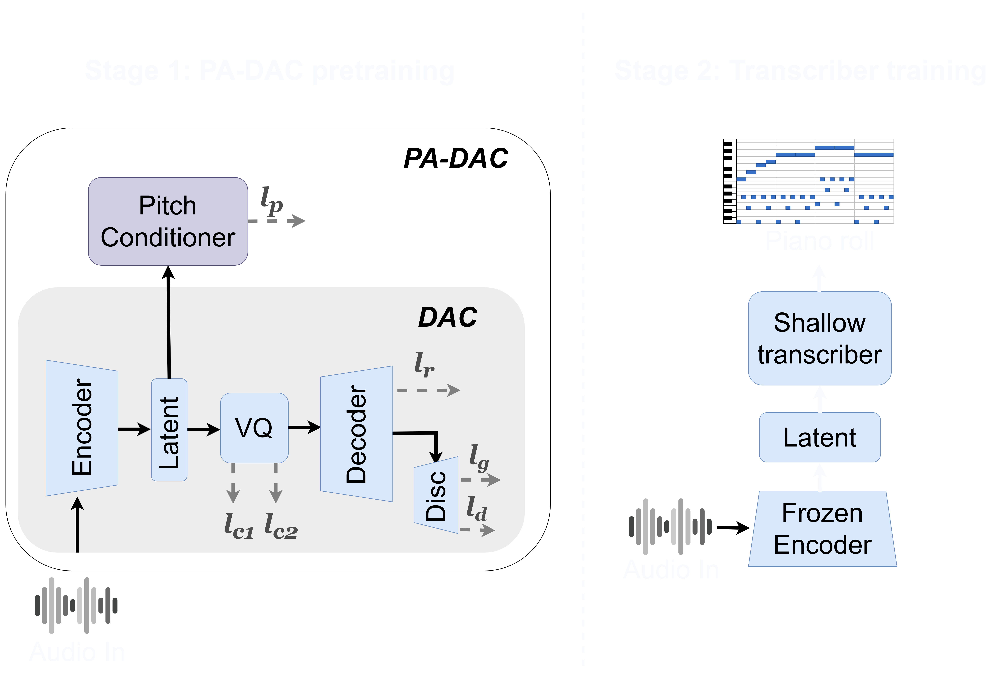

# padac-mmasia24
Source code for "Pitch-aware generative pretraining improves multi-pitch estimation with scarce data" (MMASIA 2024)

<p align="center">
</p>

### 1. Preparation
- This repo is based on the [DAC repo](https://github.com/descriptinc/descript-audio-codec), accompanying the paper ["High-Fidelity Audio Compression with Improved RVQGAN"](https://arxiv.org/pdf/2306.06546).
- Please create a virtual environment and install the packages specified in requirements.txt 
- Add [audiotools-mir](https://github.com/marypilataki/audiotools-mir) as a submodule and checkout the *mpe_labels* branch.
- Add [Basic Pitch model](https://github.com/spotify/basic-pitch) as a submodule and checkout the *main* branch.

### 2. Stage 1: pretraining
- Replace dataset paths in conf/padac/pitch_cond_padac.yml with the paths of the dataset you would like to perform pretraining on.
- Run the following command to start training. Replace *./runs* with the path to the folder where you would like the model checkpoints to be saved.
```
python -m scripts.train_padac --args.load conf/padac/conf_padac.yml --save_path ./runs
```

### 3. Stage 2: shallow transcriber training
- After freezing PA-DAC, extract and save latent space embeddings using ```latent_space = self.encoder(audio_data)```. Refer to the script *scripts/extract_features.py* for an example.
- Prepare a config file similar to conf/transcriber.json specifying the paths to the extracted features and ground truth.
- To start training, run the following command:
```
python -m scripts.train_transcriber --config_file ./conf/transcriber.json
```


